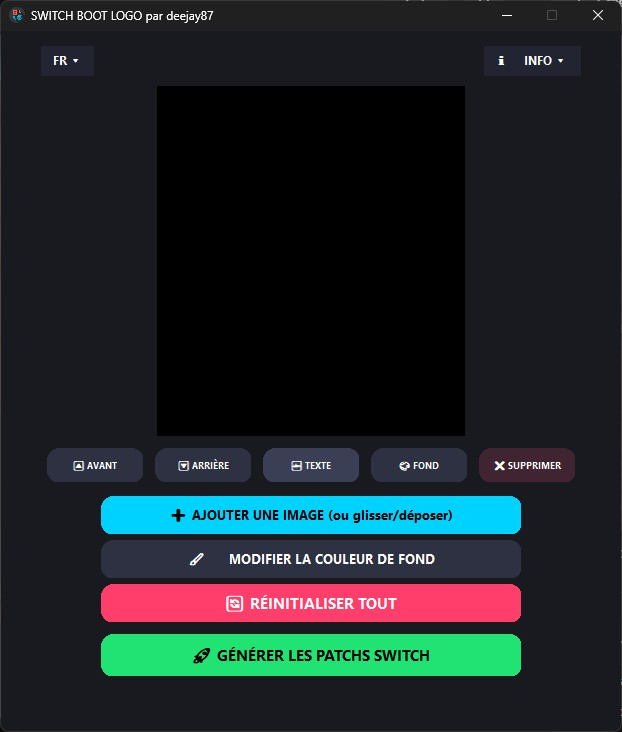
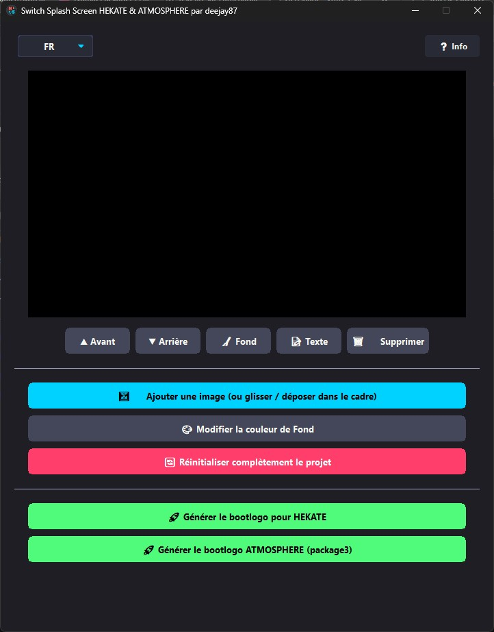

# 🎨 Switch Splash Screen & Switch Boot Logo

<p align="center">
  
  
  
  
</p>

Applications simples et intuitives avec interface graphique permettant de personnaliser le **Logo de Démarrage (Boot Logo)** et le **Splash Screen** de votre Nintendo Switch sous **Atmosphère** et **Hekate**.

L'application intègre **deux modes d'utilisation (Interne ou Externe)** au choix :
* **Mode Interne** : L'application est exécutée directement depuis la carte SD de la console.
* **Mode Externe** : L'application est exécutée sur un ordinateur (PC/Mac/Linux) et cible la carte SD de la Switch connectée en USB.

---

## 📥 Installation & Utilisation

### 🔹 Windows
* Extrayez le contenu du zip directement à la racine de votre carte MicroSD (le dossier `CUSTOMISATION`).
* Ouvrez le dossier `CUSTOMISATION` et lancez l'application via le fichier exécutable (`.exe`).
* ⚠️ **Remarque Antivirus** : L'exécutable étant compilé localement, Windows Defender ou votre antivirus peut émettre une alerte de sécurité (**faux positif**). Validez simplement l'avertissement ("Exécuter quand même") pour autoriser l'ouverture.

### 🔹 macOS
* Extrayez le contenu du zip directement à la racine de votre carte MicroSD (le dossier `CUSTOMISATION`).
* Dans le dossier `CUSTOMISATION`, double-cliquez d'abord sur l'application d'activation (`Activer ... .app`).
* Celle-ci configure les autorisations de sécurité (Gatekeeper) et ouvre automatiquement la section **Enregistrement de l'écran** (ou *Prise de vue de l'écran*) dans **Réglages Système > Confidentialité et sécurité** afin de valider l'autorisation nécessaire au bon fonctionnement du **glisser-déposer (Drag & Drop)** d'images.
* Lancez ensuite l'application principale `.app`, le fichier .txt explicatif est joint dans le dossier

### 🔹 Linux
* Extrayez le contenu du zip directement à la racine de votre carte MicroSD (le dossier `CUSTOMISATION`).
* Dans le dossier `CUSTOMISATION`, lancez l'application. Si l'exécution directe depuis l'interface graphique ne fonctionne pas, ouvrez un terminal et lancez le script d'activation via la commande `bash`, le fichier .txt explicatif est joint dans le dossier

---

## ⚙️ Workflow d'Utilisation

### 🔄 Option A : Utilisation en Mode Interne (Directement sur la SD)
1. **Extraction** : Placez le dossier `CUSTOMISATION` à la racine de votre carte MicroSD.
2. **Lancement** : Ouvrez l'application depuis votre console.
3. **Sélection** : Cochez le bouton radio **Interne** dans l'application.
4. **Création** : Éditez votre visuel (images, textes, couleurs, calques).
5. **Génération** : Cliquez sur **Générer**. Les fichiers (`.ips`, `bootlogo.bmp` ou `package3`) sont directement écrits au bon endroit sur la carte SD.

```text
💾 Carte SD (Racine)
 ├── 📁 CUSTOMISATION/        <-- Extrait automatiquement depuis le ZIP
 │    ├── 📄 (Exécutable, Appimage ou .app)
 ├── 📁 atmosphere/
 │    ├── 📄 package3        <-- Ciblé automatiquement pour le splash screen boot fusee
 │    └── 📁 exefs_patches/  <-- Dossier où sont générés les patchs IPS
 └── 📁 bootloader/
      └── 📁 res/            <-- Destination du bootlogo.bmp pour Hekate boot launch
```

### 🔌 Option B : Utilisation en Mode Externe (Depuis un PC / Mac / Linux)
1. **Connexion** : Reliez votre Nintendo Switch à votre ordinateur via câble USB.
2. **Montage USB** : Dans Hekate, allez dans `Tools` > `USB Tools` > `SD Card`.
3. **Sélection** : Ouvrez l'application sur votre ordinateur et cochez **Externe**.
4. **Détection** : Choisissez votre carte SD (`SWITCH SD`) dans la liste déroulante (utilisez le bouton 🔄 au besoin).
5. **Création & Génération** : Composez votre visuel et cliquez sur **Générer**. L'application injectera directement les éléments sur la carte SD de la console.

---

## ✨ Fonctionnalités Principales

### 🖼️ Personnalisation du Boot Logo
* **Génération automatique de patchs IPS** compatibles avec toutes les versions d'Atmosphère.

### 🚀 Personnalisation du Splash Screen
* **Bootlogo Hekate** : Génération directe du fichier `bootlogo.bmp` dans le dossier `bootloader/res/`.
* **Bootlogo Atmosphère** : Injection automatique du logo personnalisé directement dans le fichier `atmosphere/package3` (format binaire vertical 1280x720).

### 🛠️ Éditeur Graphique & Composition
* **Drag & Drop** : Glissez-déposez une ou plusieurs images directement dans l'application (format `.png` détouré pour un bon montage).
* **Formats d'images pris en charge** : Vous pouvez importer vos fichiers aux formats `.png`, `.jpg`, `.jpeg`, `.bmp`, `.tga` et `.webp`.
* **Gestion multi-calques** : Superposez plusieurs images et textes.
* **Édition dynamique** : Organisez la profondeur (premier plan / arrière-plan), redimensionnez à la molette et déplacez vos éléments.
* **Éditeur de texte avancé** : Choix des polices système, de la taille et sélection de la couleur.
* **Suppression de fond (Chroma Key)** : Outil pour rendre transparente une couleur unie sur vos images.
* **Langages** : Prise en charge multilingue (Français, Anglais, etc.) avec détection du système et menu de changement rapide.

---

## 📸 Capture d'écran

<p align="center">
  <a href="screenshots/SWITCH_BOOT_LOGO.jpg" target="_blank">
    
  </a>
  <a href="screenshots/SWITCH-SPLASH-SCREEN.jpg" target="_blank">
    
  </p>